# Multi-Task Variational Autoencoders for Breast Cancer Detection and Subtype Classification (TCGA + GTEx)

This repository contains the full code, experiments, and figures for my bachelor thesis project on breast cancer detection and molecular subtype classification using **transcriptomic gene expression** and **Variational Autoencoders (VAEs)**.

The project includes:

1) A **clean reproduction** of a VAE-based **anomaly detection** approach (paper-style: train on normals → detect tumors by reconstruction error).  
2) A **multi-head VAE (MHVAE)** with a shared latent space and two supervised heads:
   - **Head 1:** Cancer vs Normal diagnosis  
   - **Head 2:** PAM50 subtype classification (supervised only where labels exist)  
3) A **gene panel notebook** exploring compact, interpretable gene panels via **L1 (sparse) logistic regression**, and VAE anomaly detection performance across different panels.

---

## Research Questions

- **RQ1:** Can a VAE trained on normal samples detect cancer as an anomaly via reconstruction error?  
- **RQ2:** Can a **shared latent space** support **both** diagnosis and PAM50 subtype classification in a multi-task setting?  
- **RQ3:** How do compact **gene panels** (cancer-oriented vs normal-oriented) affect anomaly detection performance?  
- **RQ4:** How strong are simple baselines (e.g., **L1 logistic regression**) compared to VAEs on this dataset?

---

```markdown
## Repository Structure
```
```text
brca-multitask-vae-gene-panels/
├── data/                       # raw data goes here (ignored by git; see Data section)
├── figures/
│   ├── article/                # paper-reproduction figures
│   ├── gene_panel/             # gene-panel experiments figures
│   └── mhvae/                  # multi-head VAE figures
├── notebooks/
│   ├── 01_VAE_Article_Reproduction.ipynb
│   ├── 02_MultiHead_VAE_Diagnosis_Subtype.ipynb
│   └── 03_Gene_Panel_Analysis.ipynb
├── thesis/
│   └── Multi_task_Variational_Autoencoders_for_Breast_Cancer_Detection_draft.pdf
├── requirements.txt            # python dependencies
└── README.md                   # you are here
```
---

## Data Notes (Important)

The repository expects the following expression matrices (FPKM-like):

- `breast-rsem-fpkm-gtex.txt` : GTEx normal breast samples  
- `brca-rsem-fpkm-tcga.txt` : TCGA normal-adjacent breast samples  
- `brca-rsem-fpkm-tcga-t.txt` : TCGA BRCA tumor samples  
- `PAM50_subtype.txt` : PAM50 subtype labels for tumor samples (used inside the MHVAE notebook)

**Key preprocessing choices (to avoid leakage):**
- Patient IDs are normalized (e.g., first 12 characters) and duplicates are aggregated by mean.
- **Train/Val/Test** splitting is performed before any feature selection and scaling.
- **Feature selection** (e.g., top-K variance genes) is computed **only on the training set**.
- **MinMax scaling** is fit **only on training data**, then applied to val/test.
- Anomaly detection thresholds are tuned on **validation**, and evaluated once on **test**.

---

## Quickstart

### 1) Install dependencies

```bash
pip install -r requirements.txt

2) Run the notebooks (recommended order)
	1.	notebooks/01_VAE_Article_Reproduction.ipynb
	2.	notebooks/02_MultiHead_VAE_Diagnosis_Subtype.ipynb
	3.	notebooks/03_Gene_Panel_Analysis.ipynb
```
---

# Key Results Summary (Representative Runs)

Note: Results can vary slightly across random seeds due to stochastic optimization.
For thesis-level reporting, run multiple seeds and report mean ± std.
The figures in figures/ correspond to representative runs.

| Experiment | Notebook | Metric(s) | Output Figures |
|---|---|---|---|
| VAE anomaly detection (paper-style) | `notebooks/01_VAE_Article_Reproduction.ipynb` | ROC-AUC, reconstruction error distribution, confusion matrix | [`ROC`](figures/article/ROC_VAE_anomaly_detector.png), [`Error dist`](figures/article/Reconstruction_error_distribution.png), [`CM`](figures/article/CM_Article_Aproach.png) |
| Multi-head VAE diagnosis | `notebooks/02_MultiHead_VAE_Diagnosis_Subtype.ipynb` | ROC-AUC, confusion matrix | [`ROC+CM`](figures/mhvae/20-ROC-CM-MHVAE.png), [`ROC`](figures/mhvae/ROC-curve-multyheadVAE.png) |
| Multi-head VAE PAM50 subtypes | `notebooks/02_MultiHead_VAE_Diagnosis_Subtype.ipynb` | per-class precision/recall/F1, confusion matrix | [`Subtype CM`](figures/mhvae/MHVAE-CM-subtypeclassification.png) |
| L1 logistic baseline (diagnosis) | `notebooks/03_Gene_Panel_Analysis.ipynb` | ROC-AUC, confusion matrix | [`ROC`](figures/gene_panel/ROC-L1logisticregression.png), [`CM`](figures/gene_panel/LR-all-base-genes-diagnosis.png) |
| VAE anomaly detection across gene panels | `notebooks/03_Gene_Panel_Analysis.ipynb` | test ROC-AUC across panels | [`Panel AUCs`](figures/gene_panel/test-AUC-across-gene-panels.png) |


---

# Paper Reproduction: VAE Anomaly Detection (Normals → Tumors)

This notebook reproduces the core idea from the original paper-style approach:

	•	Train a VAE on normal samples only
	•	Use reconstruction error as an anomaly score to detect tumors

Main outputs:

	•	reconstruction error distribution
	•	anomaly ROC curve
	•	confusion matrix at a validation-tuned threshold

<p align="center">
  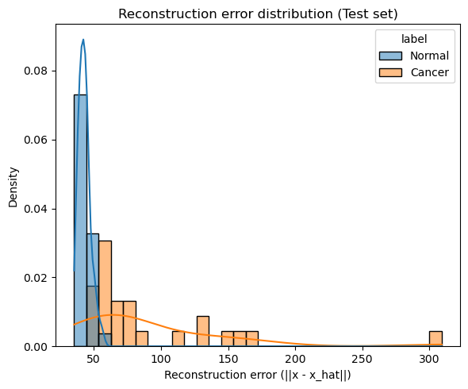
  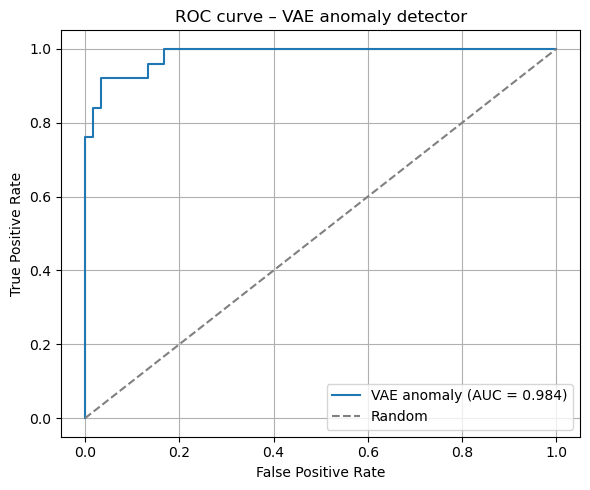
</p>


---

# Multi-Head VAE: Shared Latent Space for Diagnosis + PAM50 Subtype

This is the core contribution of the thesis.

Model summary

	•	Shared encoder → latent variables (z_mean, z_log_var)
	•	Decoder for reconstruction (VAE objective)
	•	Two supervised heads on latent z:
	•	Diagnosis head: cancer vs normal (binary)
	•	Subtype head: PAM50 classification (multiclass; trained only where labels exist via masking)

Key design choices

	•	Multi-task loss balancing: reconstruction + KL + supervised losses
	•	Subtype head uses:
	•	masking (ignore NA labels in loss)
	•	class balancing (class weights / sample weights)
	•	Early stopping monitors validation metrics (no test leakage)

Selected figures from this notebook:

<p align="center">
  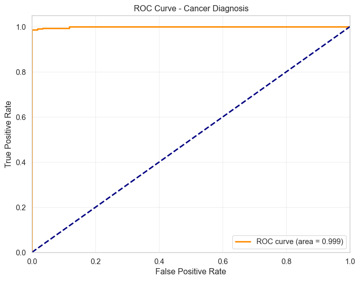
  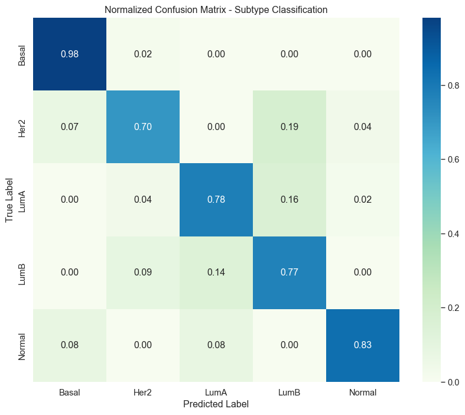
</p>


Latent space visualization (UMAP):

<p align="center">
  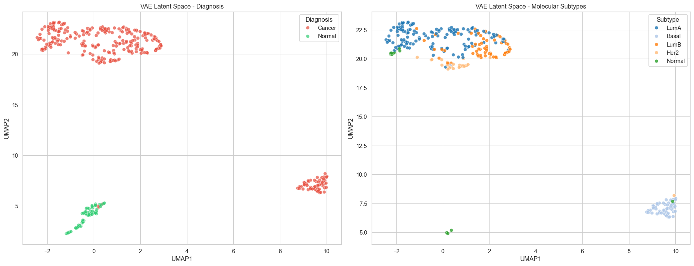
</p>


---

# Gene Panel Analysis: Sparse Biomarkers + Anomaly Detection

This notebook explores interpretability and minimal gene sets.

A) Sparse linear baselines (L1 logistic regression)

We train L1-regularized logistic regression models for:

	•	Diagnosis (cancer vs normal): yields sparse cancer-oriented gene panels
	•	Subtype classification (tumors with PAM50 labels only): yields subtype-associated genes

This acts as:

	•	a strong baseline
	•	a gene panel selection method that is typically more stable than SHAP in small datasets

<p align="center">
  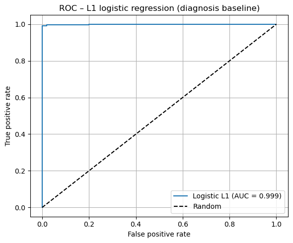
  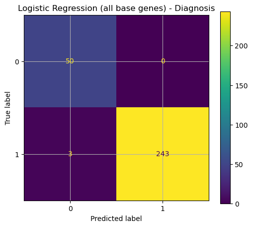
</p>


B) VAE anomaly detection across different panels

We evaluate VAE anomaly detection under different feature sets, e.g.:

	•	cancer-oriented L1 panel
	•	normal-oriented panel (variance/mean-based)
	•	larger normal panels (K=100)

<p align="center">
  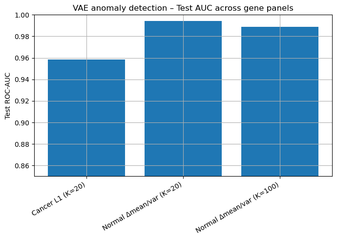
</p>


UMAP comparison of panels:

<p align="center">
  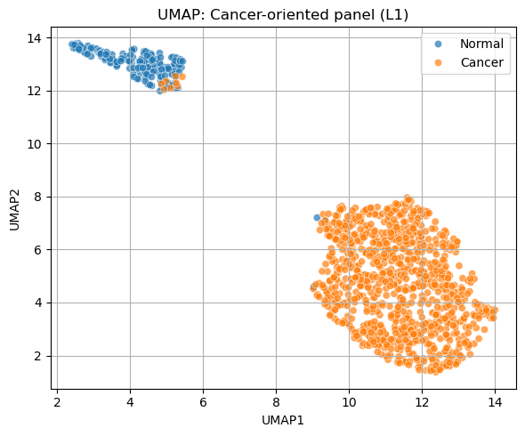
  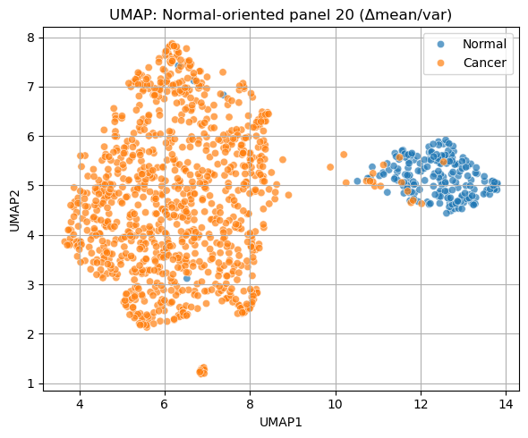
  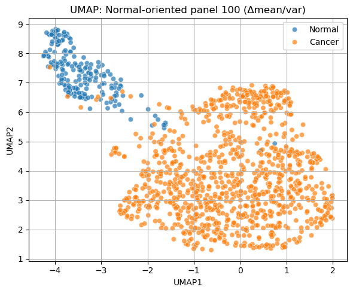
</p>


---
# Experimental Integrity Checklist (No Leakage / No Hidden Tuning)
	• No using test as validation_data
	• Feature selection computed on TRAIN only
	• Scaling fit on TRAIN only
	• Anomaly threshold tuned on VAL, evaluated once on TEST
	• PAM50 subtype loss uses masking (ignores NA labels)
	• Domain shift awareness: GTEx vs TCGA normals are not identical distributions
	• Strong baselines included (L1 logistic regression; CV + shuffled-label sanity checks)

---

# How to Reproduce the Exact Figures / Numbers

For reproducibility:

	1.	Run notebooks in the recommended order.
	2.	Use fixed seeds where provided.
	3.	Save figures to figures/... folders.

Seed control

Where supported, set:

	•	NumPy seed: np.random.seed(SEED)
	•	TensorFlow seed: tf.random.set_seed(SEED)

Which notebook generates which figures

	•	01_VAE_Article_Reproduction.ipynb → figures/article/*
	•	02_MultiHead_VAE_Diagnosis_Subtype.ipynb → figures/mhvae/*
	•	03_Gene_Panel_Analysis.ipynb → figures/gene_panel/*

If you regenerate figures, ensure filenames match those referenced in this README.

---

# Limitations 
	•	Domain shift (GTEx vs TCGA) can inflate/alter diagnosis signals if not handled carefully.
	•	Cancer vs normal separation may be nearly linearly separable in this dataset; hence, the thesis emphasizes:
	•	multi-task learning,
	•	representation learning,
	•	subtype modeling,
	•	gene panel interpretability,
rather than “accuracy alone”.

	•	This project focuses on one cancer type (BRCA); external validation on independent cohorts is future work.

---

# Thesis Document

A draft is included at:
- [Open the thesis draft (PDF)](thesis/Multi_task_Variational_Autoencoders_for_Breast_Cancer_Detection_draft.pdf)

---

# Contact

If you have questions about the code or experiments, feel free to open an issue or contact me.

